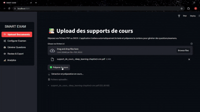

# 📝 SmartExam — AI-Powered Exam Generator

SmartExam is a Streamlit-based web application that allows educators to generate, review, and export educational questions using an AI-powered RAG (Retrieval-Augmented Generation) engine and LLM agents. Questions are generated according to Bloom’s taxonomy and can be exported in JSON or PDF formats.
 

# ⚡ Features

1. Upload & Index Documents – Use the Upload page to index educational content (PDF, TXT, DOCX).

2. Configure Exam – Set the course title, number of questions, duration, and difficulty distribution.

3. Generate Questions – Automatically generate questions by Bloom level:

   - Easy → Remember

   - Medium → Apply

   - Hard → Evaluate

4. Preview & Review – Review generated questions with text, type, points, and difficulty.

5. Export – Download questions in JSON or PDF formats.

6. Analytics – Visualize the distribution of questions by Bloom level and difficulty.

# 🚀 How it works

Check out the **Demo** of the SmartExam app in the demo/ folder 👇


> If the GIF doesn't play, you can also **[download & watch the MP4 demo](demo/Demo.mp4)**.


# 📂 Project Structure: Most important
````
SmartExam/
├─ agents/                # LLM agents for different Bloom levels
│  ├─ coordinator_agent.py
│  ├─ remember_agent.py
│  ├─ apply_agent.py
|  |      ....
│  └─ evaluate_agent.py
├─ core/                  # Core engine & LLM interface
│  ├─ rag_engine.py
│  └─ llm_interface.py    # insure using the project with different providers
├─ ui/
│  └─ pages/              # Streamlit pages
│     ├─ upload.py
│     ├─ generate.py
│     └─ review.py
├─ config.py              # Project settings
|     ├─ settings.py
├─ requirements.txt       # Python dependencies
└─ README.md
````

# 🖥 Prerequisites

* Python 3.10+

* Streamlit 1.30+ (or latest)

* Local LLM or configured API key (HuggingFace, OpenRouter, or Ollama)

* Basic knowledge of running Python projects

# ⚙️ Installation

1. Clone the repository

`git clone https://github.com/yourusername/SmartExam.git`
`cd SmartExam`

2. Create a virtual environment 

`python -m venv venv`
`venv\Scripts\activate`

3. Install dependencies

`pip install --upgrade pip`
`pip install -r requirements.txt`

4. Configure API/LLM settings

**Copy .env.example to .env:** The project comes with a reference file .env.example that contains all the environment variables you need. To use them:

`cp .env.example .env`

This will create a .env file based on .env.example.
You can then edit .env to add your API keys or configuration values without changing the example file.

| Variable                  | Description                                                               | Example / Notes          |
| ------------------------- | ------------------------------------------------------------------------- | ------------------------ |
| `HF_TOKEN`                | Your HuggingFace API token (free). Required if using HuggingFace models.  | `hf_xxx...`              |
| `LLM_PROVIDER`            | The LLM provider to use: `local`, `huggingface`, `groq`, or `openrouter`. | `local`                  |
| `LLM_MODEL`               | The LLM model for generating questions (e.g., LLaMA 3.1).                 | `llama3:8b`              |
| `EMBEDDING_MODEL`         | Open-source embedding model used for retrieval in RAG.                    | `BAAI/bge-large-en-v1.5` |
| `OPENAI_API_KEY`          | API key if using OpenAI (optional if not using).                          | `sk-xxx...`              |
| `GROQ_API_KEY`            | API key for Groq (optional).                                              | `xxxx`                   |
| `OPENROUTER_API_KEY`      | API key for OpenRouter (optional).                                        | `xxxx`                   |
| `LOCAL_LLM_MODEL`         | Path or name of the local LLM model if using `local` provider.            | `llama3:8b`              |
| `CHUNK_SIZE`              | Maximum size of text chunks for RAG indexing.                             | `1000`                   |
| `CHUNK_OVERLAP`           | Number of overlapping tokens between chunks.                              | `100`                    |
| `MAX_QUESTIONS_PER_LEVEL` | Maximum number of questions generated per Bloom level.                    | `5`                      |


## How to Fill It

**HF_TOKEN** = Go to HuggingFace
 and generate a free token, then paste it here.

**LLM_PROVIDER** = Choose which backend you want to use:

- local → run a local model like Ollama or LLaMA.

- huggingface → uses HuggingFace hosted models.

- groq → uses Groq API.

- openrouter → uses OpenRouter API.

**LLM_MODEL** = Select the model for question generation. If unsure, use the default LLaMA 3.1 model.

**EMBEDDING_MODEL** = Pick an open-source embedding model. This is used for semantic search in the RAG engine.

**API keys** = Fill only the keys relevant to your provider.

**LOCAL_LLM_MODEL** = Required if LLM_PROVIDER=local.

**Chunking parameters (CHUNK_SIZE, CHUNK_OVERLAP)** = Controls how documents are split for retrieval. Defaults are safe.

**MAX_QUESTIONS_PER_LEVEL** = Limits the number of questions generated per Bloom level to prevent excessive generation.


5. Run the app:
    
Once .env is correctly filled, your Streamlit app will read the settings automatically, and you can run the project with:
`streamlit run app.py`

## 👨‍💻 Project Maintainer & Contributors

This project is managed by **Mohamed Rayen Ben Azouz** & **Rined Lazreg**.

**🎉Shoutout for ex manager Chahed Jouini🎉**

A special shoutout to the top developers who contributed and whose work was merged into this project:

- **Tasnym Yousfi** 
- **Hedil Yousfi** 
- **Rined Lazreg** 
- **Mohamed Rayen Ben Azouz** 

Thank you all for your dedication, motivation and contributions! 🎉
